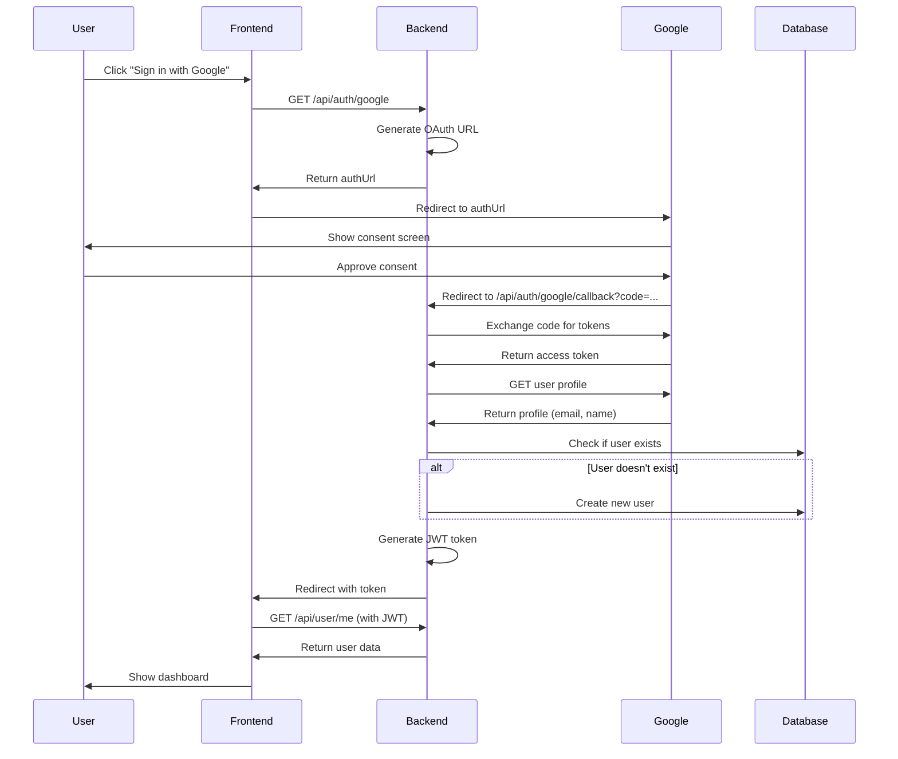

# Design Document: Google Sign-In Integration

## Overview

This design extends the existing Google OAuth infrastructure to support user authentication (login/signup) in addition to Gmail connection. The implementation reuses the OAuth client configuration and adds new authentication flows that integrate seamlessly with the existing JWT-based session management.

The design follows a redirect-based OAuth flow where users are sent to Google's consent screen, then redirected back to the application with an authorization code that is exchanged for user profile information.

## Architecture

### High-Level Flow

```
User clicks "Sign in with Google"
    ↓
Frontend requests OAuth URL from backend
    ↓
Backend generates Google OAuth URL
    ↓
Frontend redirects user to Google
    ↓
User authenticates with Google
    ↓
Google redirects to callback endpoint with code
    ↓
Backend exchanges code for tokens
    ↓
Backend retrieves user profile from Google
    ↓
Backend checks if user exists
    ↓
Backend creates user (if new) or retrieves existing user
    ↓
Backend generates JWT token
    ↓
Backend redirects to frontend with JWT token
    ↓
Frontend stores token and fetches user data
    ↓
User is authenticated and redirected to dashboard
```

### Component Interaction



## Components and Interfaces

### 1. Backend: OAuth Routes (backend/routes/googleAuth.js)

**Current State:** Already exists with Gmail OAuth functionality

**Modifications Needed:**
- The existing `/api/auth/google` endpoint already handles authentication OAuth
- The existing `/api/auth/google/callback` endpoint already handles the full flow
- No modifications needed - the infrastructure is already in place

**Endpoints:**

```javascript
// GET /api/auth/google
// Returns: { authUrl: string }
// Generates OAuth URL with userinfo scopes

// GET /api/auth/google/callback?code=...
// Redirects to: frontend_url?token=JWT_TOKEN
// Or on error: frontend_url?error=ERROR_CODE&message=ERROR_MESSAGE
```

### 2. Frontend: LoginSignup Component (components/LoginSignup.tsx)

**Current State:** Already has Google sign-in button and handler

**Modifications Needed:**
- The `handleGoogleSignIn` function already exists and works correctly
- The UI already has the Google button with proper styling
- No modifications needed - the integration is already complete

**Key Functions:**

```typescript
const handleGoogleSignIn = async () => {
  // 1. Set loading state
  // 2. Fetch OAuth URL from backend
  // 3. Redirect to Google OAuth
  // 4. Handle errors
}
```

### 3. Frontend: AuthContext (contexts/AuthContext.tsx)

**Current State:** Already handles OAuth callback token

**Modifications Needed:**
- The `useEffect` hook already checks for token in URL parameters
- Already fetches user data after receiving OAuth token
- Already stores token and user in localStorage
- No modifications needed - OAuth flow is already supported

**Key Functions:**

```typescript
useEffect(() => {
  // 1. Check for token in URL params (OAuth callback)
  // 2. Store token in localStorage
  // 3. Fetch user data with token
  // 4. Clean up URL
  // 5. Or load token from localStorage (normal page load)
}, [])
```

### 4. Backend: Auth Utilities (backend/utils/auth.js)

**Current State:** Provides JWT token generation and verification

**Modifications Needed:**
- The `generateToken` function signature needs to be updated to accept an object instead of separate parameters
- This ensures consistency with how it's called in googleAuth.js

**Current Signature:**
```javascript
export function generateToken(userId, email) {
  return jwt.sign({ userId, email }, JWT_SECRET, { expiresIn: JWT_EXPIRES_IN });
}
```

**Updated Signature:**
```javascript
export function generateToken(payload) {
  // payload: { id, email } or { userId, email }
  const userId = payload.id || payload.userId;
  const email = payload.email;
  return jwt.sign({ userId, email }, JWT_SECRET, { expiresIn: JWT_EXPIRES_IN });
}
```

### 5. Backend: Database Functions (backend/database/db.js)

**Current State:** Already has user management functions

**Functions Used:**
- `getUserByEmail(email)` - Check if user exists
- `createUser({ email, password, name })` - Create new OAuth user
- `getUserById(id)` - Retrieve user data

**No modifications needed** - existing functions support OAuth users with null passwords.

## Data Models

### User Model (Existing)

```sql
CREATE TABLE users (
  id TEXT PRIMARY KEY,
  email TEXT UNIQUE NOT NULL,
  password TEXT,  -- NULL for OAuth users
  name TEXT,
  created_at DATETIME DEFAULT CURRENT_TIMESTAMP,
  updated_at DATETIME DEFAULT CURRENT_TIMESTAMP
);
```

**OAuth User Characteristics:**
- `password` field is NULL (no password-based auth)
- `email` comes from Google profile
- `name` comes from Google profile or derived from email
- Can still use all application features (Gmail sync, applications, etc.)

### JWT Token Payload

```typescript
interface JWTPayload {
  userId: string;  // User ID from database
  email: string;   // User email
  iat: number;     // Issued at timestamp
  exp: number;     // Expiration timestamp
}
```

## Correctness Properties

*A property is a characteristic or behavior that should hold true across all valid executions of a system—essentially, a formal statement about what the system should do. Properties serve as the bridge between human-readable specifications and machine-verifiable correctness guarantees.*

### Property 1: OAuth URL Generation

*For any* valid request to `/api/auth/google`, the system should return a valid Google OAuth URL containing the correct client ID, redirect URI, and required scopes (userinfo.email, userinfo.profile).

**Validates: Requirements 1.1, 1.2, 1.3, 1.4**

### Property 2: User Creation Idempotency

*For any* Google profile with a given email address, multiple OAuth authentications should result in exactly one user account in the database (no duplicates created).

**Validates: Requirements 3.1, 3.5, 4.2**

### Property 3: OAuth User Account Structure

*For any* user account created via Google OAuth, the password field should be null, the email should match the Google profile email, and the name should be either the Google profile name or derived from the email.

**Validates: Requirements 3.2, 3.3, 3.4**

### Property 4: JWT Token Consistency

*For any* successful OAuth authentication, the generated JWT token should contain the user's ID and email, and should be verifiable using the same JWT secret as email/password authentication.

**Validates: Requirements 5.1, 5.2, 5.4, 8.2**

### Property 5: Session Persistence

*For any* successful OAuth authentication, the JWT token should be stored in localStorage, and subsequent page loads should restore the user session without requiring re-authentication.

**Validates: Requirements 5.5, 5.6**

### Property 6: Error Handling Completeness

*For any* OAuth flow error (missing code, token exchange failure, profile retrieval failure), the system should redirect to the login page with an appropriate error code and should not create a user session.

**Validates: Requirements 6.2, 6.3, 6.4, 6.5**

### Property 7: Cross-Authentication Compatibility

*For any* user account, authentication should succeed via Google OAuth regardless of whether the account was originally created with email/password or Google OAuth.

**Validates: Requirements 4.3, 4.4**

## Error Handling

### Frontend Error Scenarios

1. **OAuth URL Fetch Failure**
   - Display error message: "Failed to initiate Google sign-in"
   - Keep user on login page
   - Log error to console

2. **OAuth Callback Error Parameters**
   - Parse error code from URL parameters
   - Display user-friendly error message
   - Clean up URL parameters
   - Log error details

### Backend Error Scenarios

1. **Missing Authorization Code**
   - Redirect to: `${FRONTEND_URL}?error=missing_code`
   - Log warning

2. **Token Exchange Failure**
   - Redirect to: `${FRONTEND_URL}?error=auth_failed&message=${error.message}`
   - Log full error details

3. **Missing Email in Profile**
   - Redirect to: `${FRONTEND_URL}?error=no_email`
   - Log warning

4. **Database Error During User Creation**
   - Redirect to: `${FRONTEND_URL}?error=auth_failed&message=Database error`
   - Log full error details

### Error Messages

```typescript
const ERROR_MESSAGES = {
  missing_code: 'Authorization code was not received from Google',
  no_email: 'Could not retrieve email from Google account',
  auth_failed: 'Google authentication failed. Please try again.',
  database_error: 'Failed to create user account. Please try again.'
};
```

## Testing Strategy

### Unit Tests

Unit tests should focus on specific examples, edge cases, and error conditions:

1. **OAuth URL Generation**
   - Test that URL contains correct client ID
   - Test that URL contains correct redirect URI
   - Test that URL contains required scopes
   - Test error handling when environment variables are missing

2. **User Creation Logic**
   - Test creating user with full Google profile (email + name)
   - Test creating user with email only (name derived)
   - Test handling of existing user (no duplicate creation)

3. **JWT Token Generation**
   - Test token contains correct payload
   - Test token is verifiable with JWT secret
   - Test token expiration is set correctly

4. **Error Handling**
   - Test redirect with missing code
   - Test redirect with token exchange failure
   - Test redirect with missing email

### Property-Based Tests

Property tests should verify universal properties across all inputs (minimum 100 iterations per test):

1. **Property 1: OAuth URL Generation**
   - Generate random valid requests
   - Verify all generated URLs are valid and contain required parameters
   - **Tag: Feature: google-signin-integration, Property 1: OAuth URL Generation**

2. **Property 2: User Creation Idempotency**
   - Generate random Google profiles
   - Authenticate multiple times with same profile
   - Verify only one user account exists
   - **Tag: Feature: google-signin-integration, Property 2: User Creation Idempotency**

3. **Property 3: OAuth User Account Structure**
   - Generate random Google profiles
   - Create users via OAuth
   - Verify password is null, email matches, name is valid
   - **Tag: Feature: google-signin-integration, Property 3: OAuth User Account Structure**

4. **Property 4: JWT Token Consistency**
   - Generate random user data
   - Create JWT tokens
   - Verify all tokens are valid and contain correct payload
   - **Tag: Feature: google-signin-integration, Property 4: JWT Token Consistency**

5. **Property 5: Session Persistence**
   - Generate random authentication sessions
   - Store and retrieve tokens from localStorage
   - Verify session is restored correctly
   - **Tag: Feature: google-signin-integration, Property 5: Session Persistence**

6. **Property 6: Error Handling Completeness**
   - Generate random error scenarios
   - Verify all errors result in proper redirects with error codes
   - Verify no user sessions are created on errors
   - **Tag: Feature: google-signin-integration, Property 6: Error Handling Completeness**

7. **Property 7: Cross-Authentication Compatibility**
   - Generate random user accounts (OAuth and email/password)
   - Authenticate via OAuth
   - Verify authentication succeeds for all account types
   - **Tag: Feature: google-signin-integration, Property 7: Cross-Authentication Compatibility**

### Integration Tests

1. **Full OAuth Flow**
   - Mock Google OAuth endpoints
   - Test complete flow from button click to authenticated session
   - Verify user is created/retrieved correctly
   - Verify JWT token is generated and stored

2. **Error Flow**
   - Mock OAuth failures
   - Test error handling and user feedback
   - Verify no partial state is created

### Manual Testing Checklist

1. Click "Sign in with Google" on login page
2. Complete Google OAuth consent
3. Verify redirect to dashboard with authenticated session
4. Logout and repeat with signup page
5. Test with existing email/password account
6. Test with new Google account
7. Test error scenarios (cancel OAuth, network failure)
8. Verify session persists across page refreshes
9. Test on different browsers
10. Test on mobile devices

## Security Considerations

1. **HTTPS Only in Production**
   - OAuth redirects must use HTTPS
   - Configured via `FRONTEND_URL` and `API_URL` environment variables

2. **JWT Secret Protection**
   - Same secret used for all authentication methods
   - Stored in environment variable `JWT_SECRET`
   - Never exposed to frontend

3. **Minimal OAuth Scopes**
   - Only request `userinfo.email` and `userinfo.profile`
   - Do not request Gmail API scopes for authentication

4. **No Token Storage**
   - Google access/refresh tokens are not stored for authentication
   - Only used temporarily to retrieve user profile
   - JWT token is the only stored credential

5. **CSRF Protection**
   - OAuth state parameter could be added for additional security (future enhancement)
   - Current implementation relies on Google's OAuth security

## Implementation Notes

### Environment Variables Required

```bash
# Google OAuth (already configured for Gmail)
GOOGLE_CLIENT_ID=your_client_id
GOOGLE_CLIENT_SECRET=your_client_secret

# Application URLs
API_URL=http://localhost:3001  # or production API URL
FRONTEND_URL=http://localhost:5173  # or production frontend URL

# JWT Secret (already configured)
JWT_SECRET=your_jwt_secret
```

### Existing Infrastructure Reuse

The implementation leverages existing code:
- OAuth client configuration from `backend/config/gmail.js`
- JWT utilities from `backend/utils/auth.js`
- User database functions from `backend/database/db.js`
- Frontend auth context from `contexts/AuthContext.tsx`

### No Breaking Changes

This feature adds new functionality without modifying existing authentication:
- Email/password login continues to work
- Existing users can add OAuth login
- OAuth users can be created without passwords
- All existing API endpoints remain unchanged
