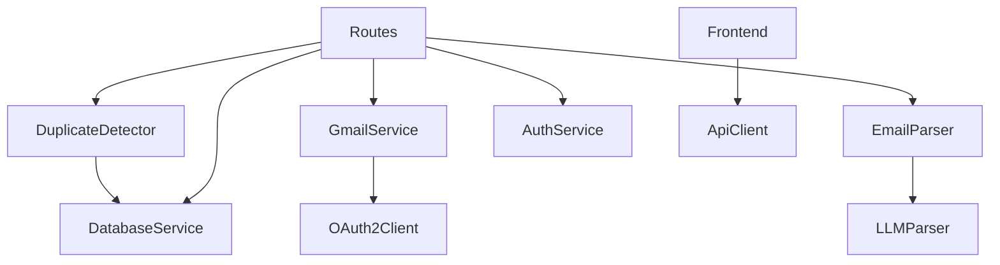

# Design Document: OOP Refactoring

## Overview

This design transforms the JobFetch/CareerPulse codebase from a functional programming style to an Object-Oriented Programming (OOP) architecture. The refactoring introduces service classes that encapsulate related functionality while maintaining complete backward compatibility with existing code.

The transformation follows a phased approach:
1. Create new class-based implementations alongside existing functional code
2. Maintain functional exports as wrappers that delegate to class methods
3. Gradually migrate internal code to use class instances
4. Ensure all existing tests pass without modification

This approach ensures zero downtime and allows for incremental migration without breaking changes.

## Architecture

### High-Level Class Structure

```
DatabaseService
  ├─ Connection management
  ├─ CRUD operations
  └─ Schema initialization

GmailService
  ├─ OAuth client management
  ├─ Email fetching
  └─ Token refresh

EmailParser
  ├─ Job email detection
  ├─ Confidence calculation
  └─ Email parsing (delegates to LLMParser)

LLMParser
  ├─ Gemini API client
  ├─ Result caching
  └─ Response validation

DuplicateDetector
  ├─ Similarity comparison
  └─ Database queries (delegates to DatabaseService)

AuthService
  ├─ Password hashing
  ├─ JWT token management
  └─ Auth middleware

FileParserService
  ├─ CSV parsing
  └─ Excel parsing

ApiClient (Frontend)
  ├─ HTTP request handling
  ├─ Authentication headers
  └─ Error handling
```

### Dependency Graph




## Components and Interfaces

### 1. DatabaseService Class

**Purpose:** Encapsulates all database operations and connection management.

**Interface:**
```typescript
interface IDatabaseService {
  // Initialization
  initialize(): Promise<void>;
  close(): Promise<void>;
  
  // Applications
  getAllApplications(userId: string): Promise<Application[]>;
  getApplicationById(id: string, userId: string): Promise<Application | null>;
  createApplication(application: Application): Promise<void>;
  updateApplication(id: string, userId: string, updates: Partial<Application>): Promise<void>;
  deleteApplication(id: string, userId: string): Promise<void>;
  
  // Status history
  addStatusHistory(applicationId: string, oldStatus: string, newStatus: string): Promise<void>;
  getStatusHistory(applicationId: string): Promise<StatusHistory[]>;
  
  // Email connections
  saveEmailConnection(connection: EmailConnection): Promise<void>;
  getEmailConnection(userId: string): Promise<EmailConnection | null>;
  disconnectEmail(userId: string): Promise<void>;
  
  // Users
  createUser(user: User): Promise<string>;
  getUserByEmail(email: string): Promise<User | null>;
  getUserById(id: string): Promise<User | null>;
  
  // Duplicates
  findDuplicateApplication(userId: string, company: string, role: string, dateApplied: string): Promise<Application | null>;
}
```

**Implementation Notes:**
- Constructor accepts optional database path
- Manages SQLite connection as private property
- Uses promisified methods for async/await
- Initializes schema on construction
- Provides graceful error handling

### 2. GmailService Class

**Purpose:** Encapsulates Gmail API operations and OAuth credential management.

**Interface:**
```typescript
interface IGmailService {
  // Email fetching
  fetchEmails(options: FetchOptions): Promise<Email[]>;
  fetchJobEmails(options: FetchOptions): Promise<Email[]>;
  getGmailProfile(): Promise<GmailProfile>;
  
  // Credential management
  setCredentials(credentials: OAuth2Credentials): void;
  refreshCredentials(): Promise<OAuth2Credentials>;
}

interface FetchOptions {
  query?: string;
  maxResults?: number;
  afterDate?: string;
  userId: string;
}
```

**Implementation Notes:**
- Constructor accepts OAuth2 client configuration
- Manages Gmail API client as private property
- Automatically refreshes expired tokens
- Throws descriptive errors for API failures
- Delegates to DatabaseService for credential storage

### 3. EmailParser Class

**Purpose:** Encapsulates email parsing logic and job detection.

**Interface:**
```typescript
interface IEmailParser {
  isJobEmail(subject: string, body: string): boolean;
  calculateConfidence(company: string, role: string, status: string, usedLLM: boolean): number;
  parseEmail(email: Email): Promise<Application | null>;
}
```

**Implementation Notes:**
- Constructor accepts LLMParser instance
- Maintains keyword lists as private properties
- Delegates LLM extraction to injected LLMParser
- Returns null for non-job emails
- Calculates confidence scores based on extraction quality

### 4. LLMParser Class

**Purpose:** Encapsulates LLM-based extraction using Google Gemini.

**Interface:**
```typescript
interface ILLMParser {
  extractWithLLM(from: string, subject: string, body: string): Promise<LLMResult | null>;
  clearCache(): void;
  getCacheStats(): CacheStats;
}

interface LLMResult {
  isJobEmail: boolean;
  company?: string;
  jobTitle?: string;
  status?: string;
  location?: string;
}
```

**Implementation Notes:**
- Constructor accepts Gemini API key
- Manages Gemini client as private property
- Implements in-memory cache with size limit
- Validates responses before returning
- Returns null when API key not configured
- Handles API errors gracefully

### 5. DuplicateDetector Class

**Purpose:** Encapsulates duplicate detection logic.

**Interface:**
```typescript
interface IDuplicateDetector {
  checkDuplicate(application: Application): Promise<DuplicateResult>;
  findSimilarApplications(application: Application, threshold: number): Promise<Application[]>;
}

interface DuplicateResult {
  isDuplicate: boolean;
  duplicateId: string | null;
  similarity: number;
  reason: string | null;
}
```

**Implementation Notes:**
- Constructor accepts DatabaseService instance
- Implements string similarity as private method
- Delegates database queries to DatabaseService
- Returns detailed duplicate information

### 6. AuthService Class

**Purpose:** Encapsulates authentication and authorization operations.

**Interface:**
```typescript
interface IAuthService {
  hashPassword(password: string): Promise<string>;
  comparePassword(password: string, hash: string): Promise<boolean>;
  generateToken(payload: TokenPayload): string;
  verifyToken(token: string): TokenPayload | null;
  authMiddleware(req: Request, res: Response, next: NextFunction): void;
  optionalAuthMiddleware(req: Request, res: Response, next: NextFunction): void;
}

interface TokenPayload {
  userId: string;
  email: string;
}
```

**Implementation Notes:**
- Constructor accepts JWT secret and configuration
- Manages JWT secret as private property
- Uses bcrypt for password hashing
- Provides middleware methods for Express
- Handles token expiration and validation

### 7. FileParserService Class

**Purpose:** Encapsulates CSV and Excel file parsing.

**Interface:**
```typescript
interface IFileParserService {
  parseCSV(file: Buffer | string): Promise<Application[]>;
  parseExcel(file: Buffer): Promise<Application[]>;
  validateFormat(file: Buffer | string, type: 'csv' | 'excel'): boolean;
}
```

**Implementation Notes:**
- Constructor accepts parsing configuration
- Validates file formats before parsing
- Returns data in consistent format
- Handles parsing errors gracefully

### 8. ApiClient Class (Frontend)

**Purpose:** Encapsulates all API communication from frontend.

**Interface:**
```typescript
interface IApiClient {
  // Health
  checkHealth(): Promise<HealthResponse>;
  
  // Applications
  getAllApplications(): Promise<Application[]>;
  getApplication(id: string): Promise<Application>;
  createApplication(application: Partial<Application>): Promise<Application>;
  updateApplication(id: string, updates: Partial<Application>): Promise<Application>;
  deleteApplication(id: string): Promise<void>;
  
  // Auth
  getAuthUrl(): Promise<{ authUrl: string }>;
  getAuthStatus(): Promise<AuthStatus>;
  disconnectEmail(): Promise<{ success: boolean }>;
  
  // Email sync
  syncEmails(options?: SyncOptions): Promise<SyncResult>;
  getEmailProfile(): Promise<EmailProfile>;
  
  // Configuration
  setToken(token: string): void;
  setBaseUrl(url: string): void;
  addInterceptor(interceptor: Interceptor): void;
}
```

**Implementation Notes:**
- Constructor accepts base URL and optional token
- Manages authentication token as private property
- Automatically adds auth headers to requests
- Provides consistent error handling
- Supports request/response interceptors


## Data Models

All existing data models remain unchanged. The refactoring only changes how data is accessed and manipulated, not the structure of the data itself.

### Application Model (Unchanged)
```typescript
interface Application {
  id: string;
  userId: string;
  company: string;
  role: string;
  location: string;
  dateApplied: string;
  lastUpdate: string;
  createdAt: string;
  status: 'Applied' | 'Interview' | 'Offer' | 'Rejected';
  source?: string;
  salary?: string;
  remotePolicy?: string;
  notes?: string;
  emailId?: string;
  confidenceScore?: number;
  isDuplicate?: number;
}
```

### User Model (Unchanged)
```typescript
interface User {
  id: string;
  email: string;
  password: string | null;
  name: string;
  created_at: string;
  updated_at: string;
}
```

### Email Connection Model (Unchanged)
```typescript
interface EmailConnection {
  id: number;
  userId: string;
  email: string;
  accessToken: string;
  refreshToken: string;
  expiresAt: string;
  connected: number;
  created_at: string;
  updated_at: string;
}
```

## Correctness Properties

*A property is a characteristic or behavior that should hold true across all valid executions of a system—essentially, a formal statement about what the system should do. Properties serve as the bridge between human-readable specifications and machine-verifiable correctness guarantees.*

### Property 1: Async/Await Support

*For any* DatabaseService method that performs I/O operations, the method should return a Promise and work correctly with async/await syntax.

**Validates: Requirements 1.7**

### Property 2: OAuth Token Refresh

*For any* GmailService instance with expired OAuth credentials, calling any email fetching method should automatically refresh the credentials using the refresh token before making the API call.

**Validates: Requirements 2.5, 2.6**

### Property 3: Gmail API Error Handling

*For any* Gmail API call that fails, the GmailService should throw a descriptive error that includes the operation name and the underlying error message.

**Validates: Requirements 2.7**

### Property 4: LLM Parser Delegation

*For any* email parsed by EmailParser, if the email passes the keyword filter, the parser should delegate to the injected LLMParser for extraction.

**Validates: Requirements 3.5**

### Property 5: Non-Job Email Filtering

*For any* email that does not contain job-related keywords, the EmailParser should return null without calling the LLMParser.

**Validates: Requirements 3.6**

### Property 6: Confidence Score Calculation

*For any* parsed application, the confidence score should be between 0 and 100, with higher scores for LLM-extracted data and complete information (company, role, status).

**Validates: Requirements 3.7**

### Property 7: LLM Result Caching

*For any* email content, calling extractWithLLM multiple times with the same subject and body should return cached results after the first call (no additional API calls).

**Validates: Requirements 4.3**

### Property 8: LLM Error Resilience

*For any* Gemini API error (network failure, rate limit, invalid response), the LLMParser should return null without throwing an exception.

**Validates: Requirements 4.5**

### Property 9: LLM Response Validation

*For any* LLM response, the LLMParser should validate that required fields (isJobEmail, and if true: company, jobTitle, status, location) are present before returning the result.

**Validates: Requirements 4.7**

### Property 10: Database Service Delegation

*For any* DuplicateDetector method that needs database access, the detector should delegate to the injected DatabaseService rather than accessing the database directly.

**Validates: Requirements 5.5**

### Property 11: Duplicate Result Structure

*For any* duplicate check result, the return value should include isDuplicate (boolean), duplicateId (string or null), similarity (number 0-1), and reason (string or null).

**Validates: Requirements 5.6**

### Property 12: JWT Token Expiration

*For any* JWT token that has expired, the AuthService verifyToken method should return null rather than the decoded payload.

**Validates: Requirements 6.5**

### Property 13: Password Hashing Round Trip

*For any* password string, hashing it with AuthService and then comparing it with comparePassword should return true, while comparing with a different password should return false.

**Validates: Requirements 6.6**

### Property 14: File Format Validation

*For any* file passed to FileParserService, if the file format is invalid, the parser should reject it before attempting to parse the content.

**Validates: Requirements 7.3**

### Property 15: File Parsing Error Handling

*For any* file parsing error (malformed CSV, corrupted Excel), the FileParserService should return a descriptive error without crashing the application.

**Validates: Requirements 7.4**

### Property 16: Parsed Data Consistency

*For any* successfully parsed file (CSV or Excel), the returned data should follow the Application interface structure with all required fields present.

**Validates: Requirements 7.5**

### Property 17: Automatic Authentication Headers

*For any* ApiClient instance with a token set, all API requests should automatically include the Authorization header with the Bearer token.

**Validates: Requirements 8.4**

### Property 18: Consistent API Error Handling

*For any* API call that fails (network error, 4xx, 5xx), the ApiClient should throw an Error with a consistent structure including the error message and status code.

**Validates: Requirements 8.5**

### Property 19: Request/Response Interceptors

*For any* registered interceptor in ApiClient, the interceptor should be called for every request and response, allowing logging and modification.

**Validates: Requirements 8.6**

### Property 20: Backward Compatible Functional Exports

*For any* existing functional export (e.g., getAllApplications, fetchEmails), calling the function should delegate to the corresponding class method and return the same result.

**Validates: Requirements 10.1, 10.6**

### Property 21: API Endpoint Compatibility

*For any* existing API endpoint, the response format and behavior should remain unchanged after refactoring to use class-based services.

**Validates: Requirements 10.2**

### Property 22: Descriptive Error Context

*For any* error thrown by a service class, the error message should include context information about what operation failed and why.

**Validates: Requirements 11.2**

### Property 23: Comprehensive Error Handling

*For any* service class method, errors should be logged appropriately, handled gracefully without crashing the application, and provide recovery mechanisms where possible.

**Validates: Requirements 11.3, 11.4, 11.5**

### Property 24: Liskov Substitution Principle

*For any* derived class or interface implementation, it should be substitutable for its base class or interface without breaking functionality.

**Validates: Requirements 14.3**


## Error Handling

### Custom Error Classes

```typescript
class DatabaseError extends Error {
  constructor(operation: string, cause: Error) {
    super(`Database operation '${operation}' failed: ${cause.message}`);
    this.name = 'DatabaseError';
    this.cause = cause;
  }
}

class GmailAPIError extends Error {
  constructor(operation: string, cause: Error) {
    super(`Gmail API operation '${operation}' failed: ${cause.message}`);
    this.name = 'GmailAPIError';
    this.cause = cause;
  }
}

class ParsingError extends Error {
  constructor(type: string, cause: Error) {
    super(`Parsing ${type} failed: ${cause.message}`);
    this.name = 'ParsingError';
    this.cause = cause;
  }
}

class AuthenticationError extends Error {
  constructor(message: string) {
    super(message);
    this.name = 'AuthenticationError';
  }
}
```

### Error Handling Patterns

1. **Database Errors**
   - Wrap SQLite errors in DatabaseError
   - Log full error details
   - Return null for not-found cases
   - Throw for critical failures

2. **API Errors**
   - Wrap API errors in GmailAPIError
   - Include operation context
   - Retry on transient failures
   - Return null for non-critical failures

3. **Parsing Errors**
   - Validate input before parsing
   - Return null for invalid emails
   - Throw ParsingError for file parsing failures
   - Log warnings for LLM failures

4. **Authentication Errors**
   - Throw AuthenticationError for invalid credentials
   - Return null for expired tokens
   - Log security-relevant events

## Testing Strategy

### Unit Tests

Unit tests should focus on specific examples, edge cases, and error conditions:

1. **DatabaseService**
   - Test CRUD operations with sample data
   - Test connection initialization and cleanup
   - Test error handling for invalid queries
   - Test transaction rollback on errors

2. **GmailService**
   - Test email fetching with mocked Gmail API
   - Test token refresh with expired credentials
   - Test error handling for API failures
   - Test query building for different options

3. **EmailParser**
   - Test job email detection with various keywords
   - Test confidence score calculation
   - Test LLM delegation
   - Test null return for non-job emails

4. **LLMParser**
   - Test extraction with mocked Gemini API
   - Test caching behavior
   - Test response validation
   - Test error handling for API failures

5. **DuplicateDetector**
   - Test exact duplicate detection
   - Test similarity calculation
   - Test database delegation
   - Test result structure

6. **AuthService**
   - Test password hashing and comparison
   - Test JWT token generation and verification
   - Test middleware behavior
   - Test token expiration

7. **FileParserService**
   - Test CSV parsing with sample files
   - Test Excel parsing with sample files
   - Test format validation
   - Test error handling for malformed files

8. **ApiClient**
   - Test request building with authentication
   - Test error handling for failed requests
   - Test interceptor execution
   - Test response parsing

### Property-Based Tests

Property tests should verify universal properties across all inputs (minimum 100 iterations per test):

1. **Property 1: Async/Await Support**
   - Generate random database operations
   - Verify all return Promises
   - **Tag: Feature: oop-refactoring, Property 1: Async/Await Support**

2. **Property 2: OAuth Token Refresh**
   - Generate random expired credentials
   - Verify automatic refresh before API calls
   - **Tag: Feature: oop-refactoring, Property 2: OAuth Token Refresh**

3. **Property 3: Gmail API Error Handling**
   - Generate random API failures
   - Verify descriptive errors are thrown
   - **Tag: Feature: oop-refactoring, Property 3: Gmail API Error Handling**

4. **Property 4: LLM Parser Delegation**
   - Generate random job emails
   - Verify LLMParser is called
   - **Tag: Feature: oop-refactoring, Property 4: LLM Parser Delegation**

5. **Property 5: Non-Job Email Filtering**
   - Generate random non-job emails
   - Verify null return without LLM call
   - **Tag: Feature: oop-refactoring, Property 5: Non-Job Email Filtering**

6. **Property 6: Confidence Score Calculation**
   - Generate random parsed applications
   - Verify scores are 0-100 and follow rules
   - **Tag: Feature: oop-refactoring, Property 6: Confidence Score Calculation**

7. **Property 7: LLM Result Caching**
   - Generate random email content
   - Verify repeated calls use cache
   - **Tag: Feature: oop-refactoring, Property 7: LLM Result Caching**

8. **Property 8: LLM Error Resilience**
   - Generate random API errors
   - Verify null return without exceptions
   - **Tag: Feature: oop-refactoring, Property 8: LLM Error Resilience**

9. **Property 9: LLM Response Validation**
   - Generate random LLM responses (valid and invalid)
   - Verify validation rejects invalid responses
   - **Tag: Feature: oop-refactoring, Property 9: LLM Response Validation**

10. **Property 10: Database Service Delegation**
    - Generate random duplicate checks
    - Verify DatabaseService is called
    - **Tag: Feature: oop-refactoring, Property 10: Database Service Delegation**

11. **Property 11: Duplicate Result Structure**
    - Generate random duplicate checks
    - Verify result has all required fields
    - **Tag: Feature: oop-refactoring, Property 11: Duplicate Result Structure**

12. **Property 12: JWT Token Expiration**
    - Generate random expired tokens
    - Verify verifyToken returns null
    - **Tag: Feature: oop-refactoring, Property 12: JWT Token Expiration**

13. **Property 13: Password Hashing Round Trip**
    - Generate random passwords
    - Verify hash/compare round trip
    - **Tag: Feature: oop-refactoring, Property 13: Password Hashing Round Trip**

14. **Property 14: File Format Validation**
    - Generate random invalid files
    - Verify rejection before parsing
    - **Tag: Feature: oop-refactoring, Property 14: File Format Validation**

15. **Property 15: File Parsing Error Handling**
    - Generate random malformed files
    - Verify descriptive errors without crashes
    - **Tag: Feature: oop-refactoring, Property 15: File Parsing Error Handling**

16. **Property 16: Parsed Data Consistency**
    - Generate random valid files
    - Verify consistent Application structure
    - **Tag: Feature: oop-refactoring, Property 16: Parsed Data Consistency**

17. **Property 17: Automatic Authentication Headers**
    - Generate random API requests with token
    - Verify Authorization header is added
    - **Tag: Feature: oop-refactoring, Property 17: Automatic Authentication Headers**

18. **Property 18: Consistent API Error Handling**
    - Generate random API failures
    - Verify consistent error structure
    - **Tag: Feature: oop-refactoring, Property 18: Consistent API Error Handling**

19. **Property 19: Request/Response Interceptors**
    - Generate random requests with interceptors
    - Verify interceptors are called
    - **Tag: Feature: oop-refactoring, Property 19: Request/Response Interceptors**

20. **Property 20: Backward Compatible Functional Exports**
    - Generate random function calls
    - Verify delegation to class methods
    - **Tag: Feature: oop-refactoring, Property 20: Backward Compatible Functional Exports**

21. **Property 21: API Endpoint Compatibility**
    - Generate random API requests
    - Verify responses match original format
    - **Tag: Feature: oop-refactoring, Property 21: API Endpoint Compatibility**

22. **Property 22: Descriptive Error Context**
    - Generate random error scenarios
    - Verify errors include context
    - **Tag: Feature: oop-refactoring, Property 22: Descriptive Error Context**

23. **Property 23: Comprehensive Error Handling**
    - Generate random errors in all services
    - Verify logging, graceful handling, recovery
    - **Tag: Feature: oop-refactoring, Property 23: Comprehensive Error Handling**

24. **Property 24: Liskov Substitution Principle**
    - Generate random derived class instances
    - Verify substitutability for base classes
    - **Tag: Feature: oop-refactoring, Property 24: Liskov Substitution Principle**

### Integration Tests

1. **Full Email Sync Flow**
   - Test complete flow from Gmail fetch to database storage
   - Verify all services work together correctly
   - Test with class-based and functional exports

2. **Authentication Flow**
   - Test complete auth flow with class-based services
   - Verify JWT generation and validation
   - Test middleware integration

3. **Backward Compatibility**
   - Run all existing tests without modification
   - Verify all pass with new class-based implementation
   - Test functional exports delegate correctly

## Implementation Notes

### Migration Strategy

1. **Phase 1: Create Classes**
   - Implement all service classes
   - Keep existing functional code unchanged
   - Add unit tests for classes

2. **Phase 2: Add Functional Wrappers**
   - Create wrapper functions that delegate to classes
   - Export both classes and functions
   - Ensure backward compatibility

3. **Phase 3: Migrate Internal Code**
   - Update routes to use class instances
   - Update services to use dependency injection
   - Keep functional exports for external use

4. **Phase 4: Verify and Deploy**
   - Run all existing tests
   - Run new property-based tests
   - Deploy with confidence

### Dependency Injection Setup

```javascript
// backend/services/container.js
import { DatabaseService } from './DatabaseService.js';
import { GmailService } from './GmailService.js';
import { LLMParser } from './LLMParser.js';
import { EmailParser } from './EmailParser.js';
import { DuplicateDetector } from './DuplicateDetector.js';
import { AuthService } from './AuthService.js';

// Create singleton instances
export const databaseService = new DatabaseService();
export const llmParser = new LLMParser(process.env.GOOGLE_AI_API_KEY);
export const emailParser = new EmailParser(llmParser);
export const gmailService = new GmailService(databaseService);
export const duplicateDetector = new DuplicateDetector(databaseService);
export const authService = new AuthService(process.env.JWT_SECRET);

// Export for use in routes
export default {
  databaseService,
  gmailService,
  emailParser,
  llmParser,
  duplicateDetector,
  authService
};
```

### Backward Compatibility Example

```javascript
// backend/database/db.js (after refactoring)
import { DatabaseService } from './DatabaseService.js';

// Create singleton instance
const dbService = new DatabaseService();

// Export class for new code
export { DatabaseService };

// Export functional wrappers for backward compatibility
export async function getAllApplications(userId) {
  return dbService.getAllApplications(userId);
}

export async function createApplication(application) {
  return dbService.createApplication(application);
}

// ... all other functions as wrappers
```

## Security Considerations

1. **Credential Management**
   - OAuth credentials managed securely in GmailService
   - JWT secrets managed securely in AuthService
   - No credentials exposed in logs or errors

2. **Input Validation**
   - All service methods validate inputs
   - File parsers validate formats before processing
   - Database queries use parameterized statements

3. **Error Information**
   - Errors include context but not sensitive data
   - Stack traces logged server-side only
   - Client errors sanitized

## Performance Considerations

1. **Connection Pooling**
   - DatabaseService reuses single connection
   - Consider connection pooling for high load

2. **Caching**
   - LLMParser implements result caching
   - Consider Redis for distributed caching

3. **Lazy Initialization**
   - Services initialize on first use
   - Reduces startup time

4. **Resource Cleanup**
   - All services provide cleanup methods
   - Ensure proper cleanup on shutdown
